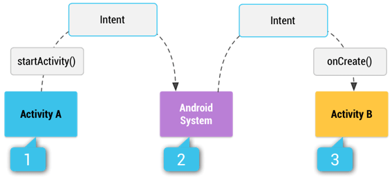

# intent
Trong android, **Intent** là những đối tượng không đồng bộ sử dụng để yêu cầu hành động từ những activity khác. Bên cạnh đó nó cho phép bạn tương tác với các thành phần từ các ứng dụng tương tự cũng như với các thành phần do các ứng dụng khác đóng góp. Ví dụ: một Activity có thể bắt đầu một Activity bên ngoài để chụp ản

Một **Intent** trong Android có thể chứa dữ liệu thông qua **Bundle** hoặc **Extra**. **Bundle** sẽ gửi dữ liệu dưới dạng đóng gói trong khi **Extra** xé lẻ dữ liệu

Trong Android, việc tái sử dụng các *application component* khác được coi là một **task**. 

Để bắt đầu một Activity chúng ta sẽ sử dụng method **startActivity(intent)**. Method này được định nghĩa trên đối tượng **Context** mà Activity mở rộng.

```kotlin
val intent = Intent(this, SecondActivity::class.java)
intent.putExtra(MESSAGE_KEY, "Hello from MainActivity")
startActivity(intent)
```

Còn để khởi động một **Service** thông qua **Intent** trong Android ta dùng method **startService(Intent)**


Phân loại **Intent**:
**Intent** trong Android hiện có 2 loại là *Intent tường minh (explicit)* và *Intent không tường minh (implicit)*
- **Intent tường minh(Explicit)**: Là những intent chỉ định rõ ràng tên của các thành phần mục tiêu để xử lý; trong đó, trường mục tiêu (tùy chọn) được sét một giá trị cụ thể thông qua các phương thức **setComponent()** hoặc **setClass()**
- **Intent không tường minh(Implicit)**: Là những intent không chỉ định rõ một mục tiêu thành phần, nhưng bao gồm đầy đủ thông tin cho hệ thống để xác định các thành phần có sẵn là tốt nhất để chạy cho mục đích đó
Ví dụ như khi gửi một tin nhắn, ta có thể yêu cầu hệ thống hiển thị những ứng dụng cung cấp hành động gửi tin nhắn.
	```kotlin 
	val intent = Intent(Intent.ACTION_SEND)  
	intent.putExtra(Intent.EXTRA_TEXT, "Hello from MainActivity")  
	intent.type = "text/plain"  
	startActivity(intent)
	```
	**Intent implicit** chỉ định hành động cần được thực hiện và dữ liệu tùy chọn, cung cấp nội dung cho hành động. Nếu một **intent implicit** được gửi đến hệ thống Android, nó sẽ tìm kiếm tất cả các *component* được đăng ký cho hành động cụ thể và kiểu dữ liệu phù hợp. Nếu chỉ tìm thấy một *component*, Android sẽ khởi động trực tiếp *component* này. Nếu một số *component* được hệ thống Android xác định, người dùng sẽ nhận được hộp thoại lựa chọn và có thể quyết định *component* nào sẽ được sử dụng cho mục đích.
	


Android hỗ trợ cho **intent explicit** và **intent implicit**. Một ứng dụng có thể xác định thành phần đích (target component) trực tiếp trong **intent (intent explicit)** hoặc yêu cầu hệ thống Android đánh giá các component đã đăng ký dựa trên dữ liệu **intent (intent implicit)**

### Xác định bộ nhận intent hợp lệ

Đôi khi bạn muốn xác định xem một *component* đã đăng ký một **intent** hay chưa. Ví dụ: bạn muốn kiểm tra xem có sẵn một bộ nhận **intent** nhất định hay không và trong trường hợp có sẵn một *component*, bạn bật một chức năng trong ứng dụng của mình.

Việc kiểm tra này có thể được thực hiện thông qua lớp  **PackageManager**

Đoạn code sau sẽ kiểm tra xem một *component* có đăng ký một **intent** nhất định hay không. Xây dựng **intent** của bạn như bạn mong muốn để kích hoạt nó và chuyển nó đến method sau.

```kotlin
public static boolean isIntentAvailable(Context context, Intent intent) {
    final PackageManager mgr = context.getPackageManager();
    List<ResolveInfo> list = mgr.queryIntentActivities(intent,PackageManager.MATCH_DEFAULT_ONLY);
    return list.size() > 0;
}
```
